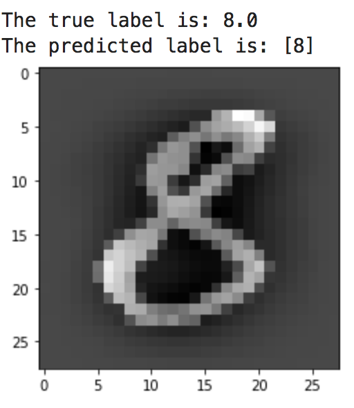
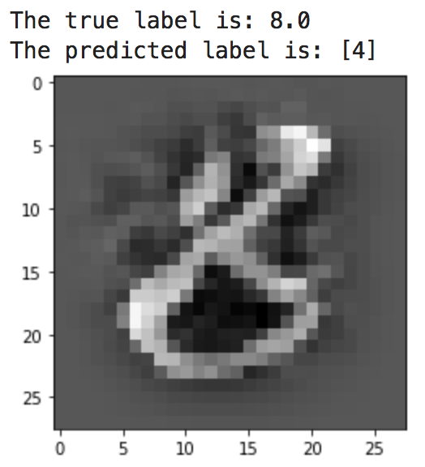

# Adversarial Machine Learning Example
This repository contains a Jupyter notebook that explains how to do a simple adversarial attack on a pretrained model. We first train a CNN model on MNIST dataset and then select a random image from the test set to develop the adversarial image. In the notebook, we selected an image of the digit 8 and we developed an adversarial image to fool the model and predict it as the digit 4 instead of digit 8.

# The Original Image

# The Adversarial Image
